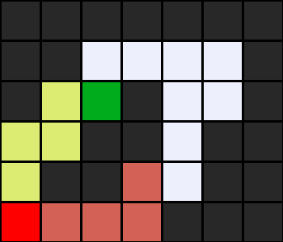
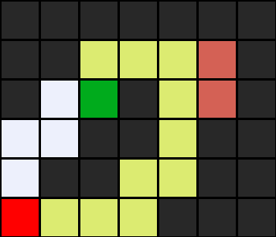

# 🎯 Maze Solver


A compact Python project that solves mazes using classic graph-search algorithms — Depth-First Search (DFS) and Breadth-First Search (BFS) — and produces visual output.

---

## 📋 Table of contents

- [Installation](#installation)
- [Quick Start](#quick-start)
- [Usage](#usage)
- [Algorithm Overview](#algorithm-overview)
- [Project Structure](#project-structure)
- [Example Output](#example-output)
- [Troubleshooting](#troubleshooting)
- [Contributing](#contributing)
- [License](#license)

---

## 🚀 Installation

Prerequisites:
- Python 3.7+
- pip

Install requirements:

```bash
pip install -r requirements.txt
```

The project uses `Pillow` to generate images.

---

## ⚡ Quick Start

Solve a maze and save a visualization:

```bash
python src/maze.py data/maze1.txt --dfs
```

Use `--bfs` to run Breadth-First Search. Use `--show-explored` to include explored cells in the output image.

Example console output (metrics):

```text
Algorithm: BFS
Cells explored: 124
Solution length: 28 steps
Output image: maze1_solution.png
```

---

## 📖 Usage

Basic command:

```bash
python src/maze.py <maze_file> [--dfs|--bfs] [--show-explored]
```

Examples:

- DFS (default): `python src/maze.py data/maze1.txt`
- BFS: `python src/maze.py data/maze2.txt --bfs`
- Show explored cells: `python src/maze.py data/maze3.txt --bfs --show-explored`

Output:
- Console: stats (algorithm, explored cells, solution length)
- PNG: `<maze_name>_solution.png` (saved in current directory)

---

## 🧠 Algorithm Overview

- **DFS (Depth-First Search)** — uses a stack; explores deep paths first. Lower average memory usage but may not produce shortest path.
- **BFS (Breadth-First Search)** — uses a queue; explores by layers and guarantees the shortest path (in number of steps).

Complexity for both (worst-case): O(V + E) where V is number of cells and E is number of edges.

Details & tradeoffs

- Data structure: `DFS` uses a *stack* (LIFO). `BFS` uses a *queue* (FIFO). This difference drives traversal order.
- Shortest path: `BFS` guarantees the fewest steps to reach the goal (unweighted grid). `DFS` does not guarantee shortest path.
- Memory: `BFS` stores all frontier nodes at current depth (can be large). `DFS` keeps one path in memory (lower peak memory in many mazes).
- Use cases: `BFS` when path optimality matters; `DFS` when memory is limited or you want faster discovery in deep mazes.

Implementation notes

- The solver represents each cell as a `Node(state, parent, action)` and reconstructs the path by following parents.
- The frontier abstraction (`StackFrontier` / `QueueFrontier`) isolates the search order from the rest of the algorithm.

---

## 📁 Project Structure

```
MazeSolver/
├── README.md
├── requirements.txt
├── .gitignore        # recommended: add __pycache__, .venv, *.pyc
├── .venv/            # optional local virtual environment (do not commit)
├── src/
│   ├── maze.py       # solver implementation (Node, Frontier, Maze)
├── data/
│   ├── maze1.txt
│   ├── maze2.txt
│   └── maze3.txt
└── assets/           # generated images (examples)
    ├── maze_bfs.png
    └── maze_dfs.png
```

## 🎨 Example Output

images included here are static PNGs demonstrating BFS/DFS outputs.

### Visual legend

- ⬛ Walls (black)
- 🟩 Solution path (green)
- 🟦 Explored cells (blue — shown when `--show-explored` is used)
- A — Start, B — Goal

### Example preview

BFS output (example):



DFS output (example):



Example maze format (`data/maze1.txt`):

```
#######
##    #
# B#  #
  ## ##
 ##  ##
A   ###
```

Legend:
- `#` wall
- space open path
- `A` start, `B` goal

---

## 🐛 Troubleshooting

- `ImportError: No module named 'PIL'` — run `pip install Pillow`
- `Exception: maze must have exactly one start point` — ensure exactly one `A` and one `B`
- `Exception: no solution` — verify that a path exists between `A` and `B`

---

## 🤝 Contributing

Contributions welcome — open issues or submit pull requests. Please add tests and update the README if you change behaviour.

---

## 📝 License

MIT License 

---

Made with ❤️ for learners and algorithm enthusiasts.
